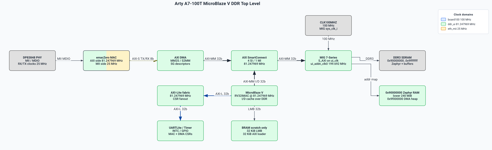

# emacz_zephyr

emacz_zephyr integrates [emacZero](https://github.com/lcapossio/emacZero) with
the AMD/Xilinx Zephyr tree for an Arty A7-100T MicroBlaze V example.

- [Features](#features)
- [Repository Layout](#repository-layout)
- [Setup](#setup)
- [Build](#build)
- [Host-configured IPv4](#host-configured-ipv4)
- [Arty A7-100T MicroBlaze V System](#arty-a7-100t-microblaze-v-system)
- [Resource Usage and Frequency](#resource-usage-and-frequency)
- [Verification](#verification)
- [Author and License](#author-and-license)

## Features

- Out-of-tree Zephyr Ethernet driver and DT binding for `bard0,emaczero`.
- Arty A7-100T MicroBlaze V example overlay for AMD Zephyr `mbv32`.
- Direct AXI DMA S2MM RX ring with zero-copy handoff to the Zephyr stack and
  a copy fallback under overload.
- Optional per-region cycle instrumentation
  (`CONFIG_ETH_EMACZERO_R7_INSTRUMENTATION`, off by default).
- Application-owned high-rate UDP endpoint on port 5001 for line-rate RX
  testing, plus a normal Zephyr socket path for arbitrary traffic.
- Host-configured IPv4 — no deployment subnet baked into the firmware.
- `external/emacZero` and `fcapz` pulled in as git submodules; Zephyr is
  pinned to AMD/Xilinx `zephyr-amd` branch `xlnx_rel_v2026.1`.

## Repository Layout

- `external/emacZero/` — emacZero RTL, docs, and bare-metal SW submodule.
- `fcapz/` — fpgacapZero debug cores and host tools submodule.
- `drivers/ethernet/` — native Zephyr emacZero Ethernet driver.
- `dts/bindings/ethernet/` — Zephyr DT binding.
- `app/` — minimal Zephyr bring-up app for the Arty A7 example.
- `hardware/` — Vivado build script, RTL, XDC.
- `scripts/` — host tools (loader, provisioning, perf-stats, stress test).
- `no_commit/BUGS.md` — local bug list required by the project rules.

## Setup

```sh
python scripts/check_env.py
west init -l .
west update
python scripts/apply_zephyr_patches.py
west zephyr-export
```

The patch step asks west for the Zephyr checkout path (falls back to
`ZEPHYR_BASE`) and applies patches required by the direct AXI DMA RX-ring
path. Re-run after every `west update`.

A RISC-V cross compiler (`riscv64-unknown-elf-gcc` or the Zephyr SDK RISC-V
toolchain) must be on `PATH`. On Windows, WSL is the recommended build shell:

```sh
python3 -m pip install --user west pykwalify
export ZEPHYR_TOOLCHAIN_VARIANT=cross-compile
export CROSS_COMPILE=/usr/bin/riscv64-unknown-elf-
```

## Build

Firmware (AMD Zephyr `mbv32` board):

```sh
west build -b mbv32 app -- \
  -DZEPHYR_TOOLCHAIN_VARIANT=cross-compile \
  -DCROSS_COMPILE=/usr/bin/riscv64-unknown-elf-
```

Add `--pristine` after DT or Kconfig changes. The app registers this repo as
a Zephyr extra module, so the local driver/binding/Kconfig are picked up
automatically.

Hardware (Vivado):

```sh
python hardware/scripts/build_arty_a7_mbv.py                # BD only
python hardware/scripts/build_arty_a7_mbv.py --synth --jobs 2   # bitstream + XSA
```

The bring-up flow avoids repeated bitstream rebuilds — load a flat
`zephyr.bin` into DDR over fcapz USER3 and release MBV through USER1 EIO:

```sh
python scripts/load_zephyr_bram.py \
  --file build-wsl-zephyr-ddr/zephyr/zephyr.bin \
  --addr 0x90000000
```

## Host-configured IPv4

The board does not have a fixed IPv4 address. On every boot it uses a
MAC-derived RFC 3927 bootstrap for provisioning. The host tool discovers it
across all active IPv4 adapters and assigns the requested address:

```sh
python -m pip install psutil
python scripts/emacz_config.py discover
python scripts/emacz_config.py configure --ip 192.168.237.200 --prefix 24
```

Discovery uses ordinary UDP: broadcasts to port 5004, replies to multicast
`239.255.77.90:5004`. No raw sockets, Npcap, or admin required. Messages
include a CRC, transaction ID, target MAC, and a short-lived offer token;
this is not authentication — keep provisioning on a trusted segment.
Configuration is intentionally runtime-only and must be re-applied after a
reboot. Use `--interface NAME`, `--bind HOST_IP`, or `--mac` to disambiguate
when multiple boards or NICs are present.

The default app registers emacZero, brings up AXI DMA-backed RX/TX,
provisions IPv4 from the host, and installs a driver-level RX interceptor
for unicast UDP port 5001 that returns each DMA buffer immediately after
accounting. ARP, ICMP, port-5004 provisioning, and every other UDP port
continue through the normal Zephyr network stack.

## Arty A7-100T MicroBlaze V System

The Zephyr board target is `mbv32`; this repo supplies the Arty overlay and
Vivado shell.

- MicroBlaze V RV32IMAC at 81.25 MHz with Zicsr/Zifencei and I/D caches.
- 256 MiB DDR3 at `0x90000000` (Arty MIG). Zephyr code/data in the lower
  240 MiB; emacZero DMA buffers and SG descriptors in the upper 16 MiB at
  `0x9f000000`.
- AXI INTC `0x41200000`, AXI Timer `0x41c00000`, AXI UARTLite `0x40600000`.
- emacZero CSRs at `0x44a00000`, Xilinx AXI DMA at `0x41e00000`. MM2S feeds
  emacZero TX, S2MM receives RX.
- `axis_rx_stream_stats` at `0x41f00000` — AXI-Stream pass-through with
  AXI-Lite CSRs for observing TLAST/handshake stalls between the MII SAF and
  AXI DMA S2MM.
- fcapz EJTAG-AXI on BSCANE2 USER3 (chain 3), EJTAG-UART on USER4, ELA on
  USER1, EIO reset on USER1 chain 1.

Split-fabric AXI: MBV, fcapz/debug, and AXI-Lite peripherals live on a
control interconnect; DMA SG/MM2S/S2MM reach DDR through a separate data
interconnect and only bridge into the control fabric when SW/debug needs
packet-buffer access.

Standalone Arty A7-100T top-level RTL diagram:

<a href="docs/architecture.svg">
  
</a>

Editable source: [docs/architecture.json](docs/architecture.json).

## Resource Usage and Frequency

Vivado 2025.2 on `xc7a100tcsg324-1`, split-fabric build, timing met at
81.25 MHz (`WNS = 0.022 ns`, `TNS = 0.000 ns`).

- Slice LUTs: 28342 / 63400 (44.7%)
- Slice registers: 42725 / 126800 (33.7%)
- Block RAM tiles: 135 / 135 (100.0%)
- DSPs: 4 / 240 (1.7%)

## Verification

Short-loop checks:

```sh
python scripts/lint.py
python -m pytest tests/test_apply_zephyr_patches.py \
  tests/test_emacz_config.py tests/test_run_arty_stress.py -q -p no:cacheprovider
python scripts/check_env.py
python hardware/sim/run.py
west build -b mbv32 app -- \
  -DZEPHYR_TOOLCHAIN_VARIANT=cross-compile \
  -DCROSS_COMPILE=/usr/bin/riscv64-unknown-elf-
```

`scripts/lint.py` resolves `ruff` and `clang-format` from `PATH`. Local
CMake/Ninja builds must use no more than half the host's logical CPUs.

Automated hardware acceptance (portable UDP, no JTAG/Npcap needed):

```sh
python -m pip install psutil
python scripts/run_arty_stress.py --interface "Ethernet 2" \
  --board-ip 192.168.237.200
```

Defaults are 600 s at 95 Mbit/s with 1472 B payloads and 100% delivery
required. Exits non-zero on any monitored MAC/gate/DMA/driver error delta.

### Measured throughput (arty_a7_100t + MicroBlaze V @ 81.25 MHz)

| Path | Offered | Delivered | Notes |
|------|---------|-----------|-------|
| Application sink-bypass (UDP :5001) | 95 Mbit/s | 95.0 Mbit/s | 600 s, 4,840,355/4,840,355 packets, 100% |
| Application sink-bypass (UDP :5001) | 100 Mbit/s | ~95.9 Mbit/s | host sender tops out at wire |
| Zephyr socket path (arbitrary UDP port) | 20/40/60 Mbit/s | ~11.9 Mbit/s (flat) | ceiling is stack CPU, not driver |

The application sink-bypass path is line-rate on 100BASE-TX with zero MAC,
RX-gate, S2MM `tready`-low, DMA/BD, allocation, or refill error deltas.

The Zephyr socket path saturates at ~11.9 Mbit/s: driver overhead is only
~10.9% of the wall (measured via the gated R7 per-region counters); the
remainder is Zephyr net-stack work on an 81.25 MHz single-core. Reaching
25-30 Mbit/s through arbitrary sockets would require a stack rewrite, a
faster CPU, or SMP. See `no_commit/BUGS.md` #33 for the analysis.

Full-duplex was verified simultaneously: 95 Mbit/s host->board RX
(48,401/48,401 packets, 94.993 Mbit/s payload) while the board sent
unthrottled TX back at ~92.5 Mbit/s, zero errors on either direction.

## Author and License

Author: Leonardo Capossio — [bard0 design](https://www.bard0.com) —
hello@bard0.com

This repository is licensed under Apache-2.0. The emacZero submodule carries
its own license in `external/emacZero/LICENSE`.
