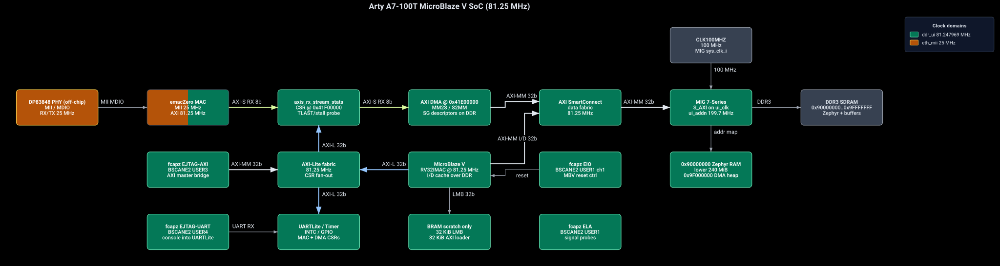
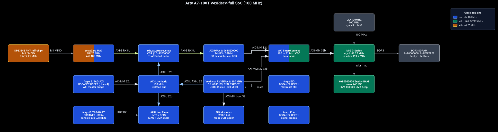

# emacz_zephyr

emacz_zephyr integrates [emacZero](https://github.com/lcapossio/emacZero) with
the AMD/Xilinx Zephyr tree for the Arty A7-100T, with two interchangeable
CPU options: AMD MicroBlaze V (`mbv32`) and SpinalHDL VexRiscv-full. Both
run the same Zephyr app, driver, and emacZero MAC — the MBV shell clocks
CPU and peripherals from MIG's 81.25 MHz `ui_clk`, while the Vex shell runs
its SoC at 100 MHz `sys_clk` and treats `ui_clk` as a downstream DDR-only
domain. The same app also targets the AMD ZCU106 over SFP, on a VexRiscv
in the PL or on the Zynq UltraScale+ PS's Cortex-R5 (see [ZCU106](#zcu106)).

- [Features](#features)
- [Repository Layout](#repository-layout)
- [Setup](#setup)
- [Build](#build)
- [Host-configured IPv4](#host-configured-ipv4)
- [Arty A7-100T SoC](#arty-a7-100t-soc)
- [ZCU106](#zcu106)
- [Resource Usage and Frequency](#resource-usage-and-frequency)
- [Throughput](#throughput)
- [Verification](#verification)
- [Author and License](#author-and-license)

## Features

- Runs the mainline Zephyr emacZero driver (`bard0,emaczero`), carried in
  `patches/zephyr/` until the pinned Zephyr tree includes it.
- Arty A7-100T shells for two CPUs: AMD MicroBlaze V (`mbv32` board) and
  SpinalHDL VexRiscv-full (16 KiB I$/D$, DYNAMIC_TARGET branch predictor,
  earlyBranch, R-slice on DBUS). Same emacZero MAC and Zephyr app on
  both.
- AMD ZCU106 shells, 1000BASE-X on SFP0: the Vex CPU complex in the PL
  (`zcu106_vex`) or Cortex-R5 #0 in the PS (`zcu106_r5`). Both pass the
  board suite.
- AXI DMA RX through Zephyr's DMA API (upstream Xilinx AXI DMA driver),
  with error recovery and zero-copy handoff to the Zephyr stack and
  a copy fallback under overload.
- UDP sink on port 5001 and a control port on 5002 for host-side RX/TX
  accounting, both through ordinary Zephyr sockets.
- Host-configured IPv4 — no deployment subnet baked into the firmware.
- `external/emacZero` and `fcapz` pulled in as git submodules; Zephyr is
  pinned to AMD/Xilinx `zephyr-amd` branch `xlnx_rel_v2026.1`.

## Repository Layout

- `external/emacZero/` — emacZero RTL, docs, and bare-metal SW submodule.
- `fcapz/` — fpgacapZero debug cores and host tools submodule.
- `patches/zephyr/` — Zephyr patches: AXI DMA driver fixes and the emacZero
  driver.
- `app/` — the Zephyr app, with per-board overlays in `app/boards/`.
- `boards/bard0/`, `soc/bard0/` — the Zephyr boards defined here
  (`arty_a7_vex`, `zcu106_vex`, `zcu106_r5`) and the VexRiscv SoC
  (`vexriscv_axi`) the two Vex boards share.
- `hardware/` — Vivado build scripts, RTL, XDC.
- `scripts/` — host tools (loader, provisioning, perf-stats, stress test).
- `no_commit/BUGS.md` — local bug list required by the project rules.

## Setup

```sh
python scripts/check_env.py
west init -l .
west update
python scripts/apply_zephyr_patches.py
west zephyr-export
```

The patch step asks west for the Zephyr checkout path (falls back to
`ZEPHYR_BASE`) and applies the Xilinx AXI DMA driver patches in
`patches/zephyr/`: 0001 brings the driver up to upstream Zephyr
`ac03a4a9085`, 0002 adds an optional `memory-region` property that places
the scatter-gather descriptor rings in a given linker region, and 0003
reports a channel halted by a DMA error to the client callback (`-EIO`) so
the driver can reset and rebuild both channels. 0004 adds the emacZero
Ethernet driver and DT binding as submitted to mainline Zephyr, and 0005
backports it to this tree's older Ethernet API. 0006 is upstream
`ef5b9dc5c1e`, which stops devicetree MPU regions from corrupting their
memory type on Cortex-R; the ZCU106 R5 build maps the PL window and its
DMA memory that way. Re-run after
every `west update`; it skips patches that are already applied and refuses
to touch locally modified driver files.

A RISC-V cross compiler (`riscv64-unknown-elf-gcc` or the Zephyr SDK RISC-V
toolchain) must be on `PATH`. On Windows, WSL is the recommended build shell:

```sh
python3 -m pip install --user west pykwalify
export ZEPHYR_TOOLCHAIN_VARIANT=cross-compile
export CROSS_COMPILE=/usr/bin/riscv64-unknown-elf-
```

The `zcu106_r5` board needs an Arm compiler instead, such as the Zephyr
SDK's `arm-zephyr-eabi` toolchain, and the CMSIS module that `west update`
fetches.

## Build

Firmware — pick the board that matches the bitstream you will program:

```sh
# MicroBlaze V shell (AMD Zephyr in-tree board):
west build -b mbv32 -d build-mbv-emac app -- \
  -DZEPHYR_TOOLCHAIN_VARIANT=cross-compile \
  -DCROSS_COMPILE=/usr/bin/riscv64-unknown-elf-

# VexRiscv-full shell (board defined in this repo):
west build -b arty_a7_vex -d build-vex-emac app -- \
  -DZEPHYR_TOOLCHAIN_VARIANT=cross-compile \
  -DCROSS_COMPILE=/usr/bin/riscv64-unknown-elf-
```

The two boards are not interchangeable: `arty_a7_vex` sets a 100 MHz timer
base and builds without the C extension, which the RV32IMA VexRiscv core
lacks. Booting an `mbv32` image on the Vex bitstream traps on the first
compressed instruction; the reverse gives a ~23% timer error.

Add `--pristine` after DT or Kconfig changes. The app registers this repo as
a Zephyr extra module, so the `arty_a7_vex` board, its SoC and the app
Kconfig are picked up automatically.

Hardware (Vivado):

```sh
# MicroBlaze V shell:
python hardware/scripts/build_arty_a7_mbv.py                     # BD only
python hardware/scripts/build_arty_a7_mbv.py --synth --jobs 2    # bitstream + XSA

# VexRiscv-full shell (regenerates VexRiscvAxi4.v via sbt on WSL):
python hardware/scripts/build_arty_a7_vex.py                     # BD only
python hardware/scripts/build_arty_a7_vex.py --synth --jobs 2    # bitstream + XSA
```

The bring-up flow avoids repeated bitstream rebuilds. Program the shell's
bitstream once (Vivado on PATH), then load a flat `zephyr.bin` into DDR over
fcapz JTAG-AXI. The loader holds the CPU in reset while it writes and
verifies the image, then releases it. MicroBlaze V's reset is an fcapz EIO
output; VexRiscv's is an AXI GPIO behind the bridge.

```sh
python scripts/program_fpga.py --shell mbv       # or --shell vex
python scripts/load_zephyr_bram.py --shell mbv   # build-mbv-emac/zephyr/zephyr.bin, chain 3
python scripts/load_zephyr_bram.py --shell vex   # build-vex-emac/zephyr/zephyr.bin, chain 4
```

`program_fpga.py --bit` and `load_zephyr_bram.py --file`, `--addr` and `--chain`
override the per-shell defaults.

## Host-configured IPv4

The board does not have a fixed IPv4 address. On every boot it uses a
MAC-derived RFC 3927 bootstrap for provisioning. The host tool discovers it
across all active IPv4 adapters and assigns the requested address:

```sh
python -m pip install psutil
python scripts/emacz_config.py discover
python scripts/emacz_config.py configure --ip 192.168.237.200 --prefix 24
```

Discovery uses ordinary UDP: broadcasts to port 5004, replies to multicast
`239.255.77.90:5004`. No raw sockets, Npcap, or admin required. Messages
include a CRC, transaction ID, target MAC, and a short-lived offer token;
this is not authentication — keep provisioning on a trusted segment.
Configuration is intentionally runtime-only and must be re-applied after a
reboot. Use `--interface NAME`, `--bind HOST_IP`, or `--mac` to disambiguate
when multiple boards or NICs are present.

The default app brings up emacZero with AXI DMA-backed RX/TX, provisions
IPv4 from the host, and serves a UDP sink on port 5001 and a control port
on 5002. All traffic, including provisioning on port 5004, goes through
the normal Zephyr network stack.

## Arty A7-100T SoC

Two shells, one SoC. The peripheral map is identical between them; only the
CPU macro and its AXI plumbing change.

Shared SoC:

- Board oscillator `CLK100MHZ` (100 MHz) drives the MIG; each shell picks
  its own SoC clock from there (see per-shell bullets below).
- 256 MiB DDR3 at `0x90000000` (Arty MIG). Zephyr code/data in the lower
  240 MiB. The upper 16 MiB at `0x9f000000` lies outside both CPUs' D-cache
  aperture: its first 64 KiB is the `dma_desc` memory region holding the
  AXI DMA SG descriptor rings, and emacZero frame buffers follow from
  `0x9f010000`.
- AXI INTC `0x41200000`, AXI Timer `0x41c00000`, AXI UARTLite `0x40600000`.
- emacZero CSRs at `0x44a00000`, Xilinx AXI DMA at `0x41e00000`. MM2S feeds
  emacZero TX, S2MM receives RX.
- `axis_rx_stream_stats` at `0x41f00000` — AXI-Stream pass-through with
  AXI-Lite CSRs for observing TLAST/handshake stalls between the MII SAF and
  AXI DMA S2MM.
- Split-fabric AXI: CPU, fcapz/debug, and AXI-Lite peripherals live on a
  control interconnect; DMA SG/MM2S/S2MM reach DDR through a separate data
  interconnect and only bridge into the control fabric when SW/debug needs
  packet-buffer access.

MicroBlaze V shell (`hardware/scripts/build_arty_a7_mbv.py`, Zephyr board
target `mbv32`):

- MicroBlaze V RV32IMAC with Zicsr/Zifencei and I/D caches.
- CPU and every AXI/AXI-Lite fabric run on `mig_ddr/ui_clk` at **81.25 MHz**
  (MIG PHY ratio 4:1, 325 MHz DDR). No separate SoC clock.
- fcapz EJTAG-AXI on BSCANE2 USER3 (chain 3), EJTAG-UART on USER4, ELA on
  USER1, EIO reset on USER1 chain 1.

VexRiscv-full shell (`hardware/scripts/build_arty_a7_vex.py`, Zephyr board
target `arty_a7_vex` — defined in-tree under `boards/bard0/arty_a7_vex/`
and `soc/bard0/vexriscv_axi/`):

- SpinalHDL VexRiscv-full RV32IMA with `IBusCachedPlugin` (16 KiB I$,
  DYNAMIC_TARGET branch predictor, `historyRamSizeLog2=8`) and
  `DBusCachedPlugin` (16 KiB D$), `BranchPlugin(earlyBranch=true)`,
  `CsrPlugin` with `mtvecAccess=READ_WRITE`.
- CPU and SoC-side AXI/AXI-Lite fabrics run on `sys_clk` at **100 MHz**;
  MIG's 81.25 MHz `ui_clk` is a private domain behind a CDC in the DDR
  SmartConnect.
- AXI register slice on the CPU DBUS R-channel to break the CPU→xbar→I$
  combinational path — required for 100 MHz timing on Artix-7.
- fcapz EJTAG-AXI is one chain higher than MBV (chain 4 instead of 3)
  because Vex's own JTAG debug port sits ahead of it in the BSCAN chain.
  `scripts/load_zephyr_bram.py --shell vex` and the perf readers'
  `--chain 4` account for this.

Top-level RTL diagrams (click for full-size SVG):

**MicroBlaze V shell (81.25 MHz single domain):**

<a href="docs/architecture_mbv.svg">
  
</a>

**VexRiscv-full shell (100 MHz SoC + 81.25 MHz DDR UI):**

<a href="docs/architecture_vex.svg">
  
</a>

Editable sources: [docs/architecture_mbv.json](docs/architecture_mbv.json),
[docs/architecture_vex.json](docs/architecture_vex.json).

## ZCU106

Two hardware shells for the AMD ZCU106 (`xczu7ev`) share one PL Ethernet
subsystem: emacZero in GMII mode behind the AMD 1G/2.5G Ethernet PCS/PMA
core, 1000BASE-X on SFP cage 0, with the AXI DMA, the RX stream counters, a
PCS status GPIO and the fcapz JTAG-AXI bridge (USER4, chain 4). The SoC side
runs at 150 MHz from the 300 MHz `USER_SI570`; emacZero's CDC crosses to
the transceiver's 125 MHz `userclk2`. `hardware/scripts/build_zcu106.py`
builds either one.

Both shells meet timing and pass the whole board suite (below) on a ZCU106
whose SFP0 links to a 1 Gbit/s host NIC: boot, provisioning, RX accounting
with every datagram delivered, DMA error recovery and TX. Each shell needs
its own MAC address when they share a segment with an Arty (`--mac`;
the overlays use `02:00:00:00:00:02` for Vex and `:03` for the R5).

`zcu106_vex` (`--variant vex`) is the Arty Vex shell's CPU complex and
address map, with UltraRAM in place of DDR3: 512 KiB at `0x90000000` for
Zephyr, inside the D-cache aperture, and 512 KiB at `0x9ff80000` outside it
for the DMA descriptors, frame buffers and the host page, which stays at
`0x9fffe000`. Its console is the PL UART, the CP2108's third interface.

`zcu106_r5` (`--variant r5`) runs Zephyr on Cortex-R5 #0. The R5 reaches the
PL blocks through `M_AXI_HPM0_LPD` at `0x80000000` + the Vex offsets (AXI
DMA `0x81e00000`, emacZero `0x84a00000`), and the DMA reaches PS DDR through
`S_AXI_HP0_FPD`. Zephyr runs from the bottom 64 MiB of DDR. The frame
buffers (`0x07c00000`), descriptors (`0x07e00000`) and host page
(`0x07ffe000`) are non-cacheable MPU regions above it, clear of the TCM
window at `0x0` that the PL cannot reach. The PL interrupts are GIC SPIs
89–92. Its console is PS UART0, the CP2108's first interface.

| | `zcu106_vex` | `zcu106_r5` |
|---|---|---|
| CLB LUTs | 22,667 (9.8%) | 13,923 (6.0%) |
| CLB Registers | 26,572 (5.8%) | 18,708 (4.1%) |
| Block RAM tiles | 27 | 13 |
| UltraRAM | 33 | 0 |
| Setup WNS | +0.977 ns | +1.608 ns |

The board needs a 1000BASE-X SFP module in cage 0 and a link partner that
speaks it, such as a fibre NIC or a switch port. DIP switch `GPIO_DIP_SW0`
turns auto-negotiation off for partners that do not negotiate, and user LEDs
0–3 show GT reset done, PCS sync, link up and the `userclk2` heartbeat. JTAG
and the CP2108 UART both need their USB cables connected.

Build:

```sh
python hardware/scripts/build_zcu106.py --variant vex --synth
python hardware/scripts/build_zcu106.py --variant r5 --synth   # bitstream, XSA, FSBL
python hardware/scripts/build_zcu106.py --variant r5 --fsbl    # just the FSBL, from the XSA

west build -b zcu106_vex -d build-zcu106-vex app --   -DZEPHYR_TOOLCHAIN_VARIANT=cross-compile   -DCROSS_COMPILE=/usr/bin/riscv64-unknown-elf-
west build -b zcu106_r5 -d build-zcu106-r5 app --   -DZEPHYR_TOOLCHAIN_VARIANT=cross-compile   -DCROSS_COMPILE=<zephyr-sdk>/arm-zephyr-eabi/bin/arm-zephyr-eabi-
```

Boot:

```sh
# Vex: bitstream, then the image into UltraRAM over JTAG-AXI
python scripts/program_fpga.py --shell zcu106_vex
python scripts/load_zephyr_bram.py --shell zcu106_vex

# R5: one xsdb session puts the PS in JTAG boot mode, resets it, programs
# the PL, runs the FSBL on R5 #0, then loads and starts zephyr.elf there
python scripts/load_zynqmp_r5.py
```

The R5 build makes a Zynq MP FSBL for R5 #0 from the XSA with `xsct`, so it
needs Vitis installed next to Vivado (or `xsct` on `PATH`). The loader runs
it before Zephyr, as a normal boot would: it initialises the PS, sizes the
DDR from the SODIMM's SPD, initialises the TCM ECC and, finding the PL
configured, lifts the PS-PL isolation and resets the PL. In JTAG boot mode
it then parks and flags completion in `PMU_GLOBAL.GLOB_GEN_STORAGE5`, which
the loader waits for. Running only `psu_init` instead leaves R5 reads from
DDR hanging now and then. `--fsbl` picks another FSBL image.

`load_zynqmp_r5.py` needs `xsdb` (Vivado or Vitis) on `PATH`. It takes every
xsdb target from the JTAG cable whose FPGA is the `xczu7` (`--tap`), and
`program_fpga.py` searches every cable for its device, so other boards on
the same `hw_server` are left alone. The fcapz tools find the FPGA by its
exact xsdb JTAG name, `xczu7` (`xsdb` then `connect; jtag targets` lists
it). A board that is missing or named differently fails with "target list
is empty".

The board suite runs the whole acceptance flow on any shell: boot,
provisioning, the RX accounting test, DMA error recovery and the TX
benchmark. It stops at the first step that fails:

```sh
python scripts/run_board_suite.py --shell zcu106_r5   --interface "<host NIC>" --board-ip <board IPv4> --uart <console port>
```

`--shell` is one of `mbv`, `vex`, `zcu106_vex` and `zcu106_r5`; `--skip-boot`
tests a board that is already running.

## Resource Usage and Frequency

Vivado 2025.2 on `xc7a100tcsg324-1`, split-fabric build, both shells timing
MET at their target frequencies (MBV: 81.25 MHz `ui_clk`; Vex: 100 MHz
`sys_clk` + 81.25 MHz `ui_clk` behind CDC).

| Resource | MBV | Vex | Δ (vex − mbv) |
|---|---|---|---|
| Slice LUTs | 34,705 (54.74%) | 28,902 (45.59%) | −5,803 (−16.7%) |
| Slice Registers | 46,110 (36.36%) | 29,373 (23.16%) | −16,737 (−36.3%) |
| BRAM Tiles | 44 (32.59%) | 36 (26.67%) | −8 (−18.2%) |
| DSPs | 4 (1.67%) | 4 (1.67%) | 0 |
| Setup WNS | +0.680 ns | +0.282 ns | — |

Vex is the cheaper CPU on this Artix-7 target despite carrying 16 KiB
I$/D$ and a DYNAMIC_TARGET branch predictor. Full breakdown, including
LUT-as-memory and F7/F8 wide-mux counts, is in
[docs/cpu_comparison.md](docs/cpu_comparison.md).

## Throughput

UDP with 1472 B payloads through Zephyr sockets, delivered rate as counted
by the board (`scripts/run_udp_accounting.py`, `scripts/run_tx_accounting.py
--rate-mbps 0`):

| Path | MBV (81.25 MHz) | Vex (100 MHz) |
|---|---|---|
| RX, socket sink on port 5001 | 8.5 Mbit/s (~720 frames/s) | 8.5 Mbit/s (~720 frames/s) |
| TX, `zsock_sendto` loop | 9.5 Mbit/s | 11.7 Mbit/s |

Both CPUs hit the same RX ceiling because it is set by memory latency,
not the core. The emacZero frame buffers sit in uncached DDR, and the
socket's copy of each payload out of them costs ~1.07 ms of the
~1.39 ms per frame on both shells: the UDP payload starts 2 bytes off a
word boundary, so `memcpy` falls back to byte reads of uncached memory.

Above the RX ceiling the delivered rate holds: when the stack has no
packet free, the driver's RX thread waits for one instead of dropping the
frame, so S2MM runs out of buffers and the excess is dropped in hardware
and counted, at no CPU cost. DMA and the rest of the system stay healthy.

Earlier versions of this repository reported ~95 Mbit/s through a
driver-level interceptor for port 5001 that bypassed the network stack.
The mainline driver has no such hook. Pick MBV for a Vivado-native
toolchain end-to-end, or Vex for the FPGA-area savings above and a
rebuild pipeline that uses SpinalHDL/sbt; see
[docs/cpu_comparison.md](docs/cpu_comparison.md).

## Verification

Short-loop checks:

```sh
python scripts/lint.py
python -m pytest tests/test_apply_zephyr_patches.py tests/test_board_boot.py \
  tests/test_emacz_config.py tests/test_run_arty_stress.py -q -p no:cacheprovider
python scripts/check_env.py
python hardware/sim/run.py
for board in mbv32 arty_a7_vex; do
  west build -b "$board" -d "build-check-$board" app -- \
    -DZEPHYR_TOOLCHAIN_VARIANT=cross-compile \
    -DCROSS_COMPILE=/usr/bin/riscv64-unknown-elf-
done
```

`scripts/lint.py` resolves `ruff` and `clang-format` from `PATH`. Local
CMake/Ninja builds must use no more than half the host's logical CPUs.

Automated hardware acceptance (portable UDP, no JTAG/Npcap needed):

```sh
python -m pip install psutil
python scripts/run_arty_stress.py --interface "Ethernet 2" \
  --board-ip 192.168.237.200
```

Defaults are 600 s at 5 Mbit/s with 1472 B payloads and 100% delivery
required, below the socket path's ceiling (see
[Throughput](#throughput)). Exits non-zero on any monitored
MAC/gate/DMA/driver error delta.

`scripts/run_board_suite.py` (see [ZCU106](#zcu106)) runs boot,
provisioning, RX accounting, DMA recovery and TX in one go, on the Arty
shells too.

DMA error recovery (JTAG for the descriptor ring and perf counters;
`--chain 3` on MBV, `4` on Vex):

```sh
python scripts/run_dma_recovery_test.py --chain 3 \
  --board 192.168.237.200 --bind 192.168.237.1
```

The test zeroes the length of the RX descriptor at S2MM's TAILDESC, one
the engine cannot have fetched yet, and sends traffic until S2MM reaches
it and halts with DMAIntErr, no memory written. It passes when the driver
counted exactly one RX DMA failure (`rx_dma_failed`), S2MM runs without
error, RX counts are exact afterwards and TX works. `--rate-mbps`
(default 5) must stay below the socket path's ceiling for the exact count
to be meaningful.

## Author and License

Author: Leonardo Capossio — [bard0 design](https://www.bard0.com) —
hello@bard0.com

This repository is licensed under Apache-2.0. The emacZero submodule carries
its own license in `external/emacZero/LICENSE`.
